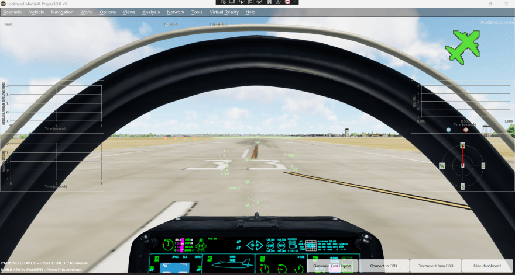

# Sandia Labs Managed Dashboard

Interactive dashboard overlay that snaps to and follows around an open instance
of the Prepar3D simulator window.

# Requirements

- Purchased copy of Prepar3D version 5.
    - Prepar3D SDK version 5.4.9.
- Visual Studio 2022 with C#.
- Nuget package manager.

# Installation

After obtaining requirements for project, clone project through Visual Studio.
Open the solution file, build, and run. Open an instance of Prepar3D and you
should see the overlay render on top of the simulator.

# Features

- Fully transparent overlay that follows and resizes to fit the simulator window
  automatically.
- Connect, disconnect, show/hide, and PDF report buttons.
- Visualizes altitude, speed, pitch, G-force, and magnetic heading.
- Allows you to output current flight data of the session in both CSV and PDF
  format.

# License

This project uses MIT license.
